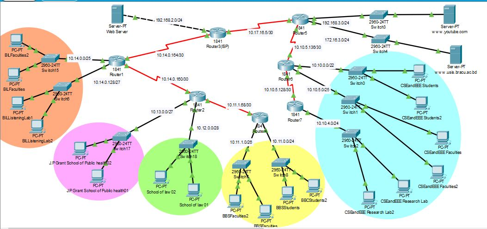

# 🌐 Computer Network Project – BRACU Campus Network Design

> A complete enterprise-level network topology designed for BRAC University (BRACU),
> built using Cisco Packet Tracer with VLSM, NAT, ACLs, and inter-school routing.

---

## 📁 Repository Contents

| File | Description |
|------|-------------|
| `CSE421LABPRO.pkt` | Cisco Packet Tracer project file |
| `Packet.JPG` | Network topology diagram |
| `[CSE421][Project-05]BRACU.docx` | Full project documentation |

> 💡 Clone the repo and open the `.pkt` file in Cisco Packet Tracer to explore the topology.

---

## 🗺️ Network Topology



---

## 🏫 Network Specifications

### SECS (School of Engineering & Computer Science)
- 2 departments: **CSE** and **EEE**
- Largest school on campus
- 16 labs (700 PCs) — 14 normal + 2 research labs
- 90 faculty members and staff
- **800+ IPs required** — first 600 for students, rest for faculty/staff/research
- Connected to the internet
- Local servers: `youtube.com` and `usis.bracu.ac.bd`
- Can afford only **3 real IPs**

### BBS (BRAC Business School)
- 2nd largest school
- 3 student labs
- 50 faculty members and staff
- **300 IPs required**, only **20 real IPs** available

### School of Law
- 14 faculty members
- **Static IPs required** (no dynamic assignment)

### James P. Grant School of Public Health
- Research-based school
- **Fixed/static IPs** required for research purposes
- 20 PCs

### BIL
- 70 faculty members and staff
- Listening lab with 15 student PCs

### Outside Network (Internet)
- Simulates the external internet connection for BRACU
- Contains a single browseable **web server**

---

## 📋 Access Control Rules (ACL Policies)

| Rule | Details |
|------|---------|
| 🚫 Students | Cannot access the local YouTube server |
| ✅ Faculty & Staff | Can access `youtube.com` |
| ✅ Research Lab Students | Can access `youtube.com` |
| 🔒 James P. Grant School | Does **not** allow connections from other schools |
| 🔗 SECS ↔ BIL | Can connect with each other |
| 🚫 Other Schools → BIL | Cannot access BIL |
| 🚫 External Packets | Automatically denied |

---

## ⚙️ Technical Implementation

- ✅ VLSM (Variable Length Subnet Masking) — applied multiple times
- ✅ NAT for schools with limited real IPs
- ✅ Static routing for Law School and Public Health
- ✅ ACLs for access control enforcement
- ✅ Backup route to internet for SECS
- ✅ Route summarization where applicable
- ✅ Minimum 2 PCs/Laptops per individual network
- ✅ Routers and Switches used appropriately

---

## 🚀 Getting Started

1. Clone the repository
```bash
   git clone https://github.com/H-Shahriar/Computer-Network-Project.git
```
2. Open `CSE421LABPRO.pkt` in **Cisco Packet Tracer**
3. Explore the topology and configurations

---

## 🛠️ Tools Used

- **Cisco Packet Tracer** – Network simulation
- **VLSM** – IP address planning
- **ACL** – Access control
- **NAT/PAT** – IP translation
- **OSPF / Static Routing** – Routing protocols

---

## 👤 Author

**Hasan Shahriar**
